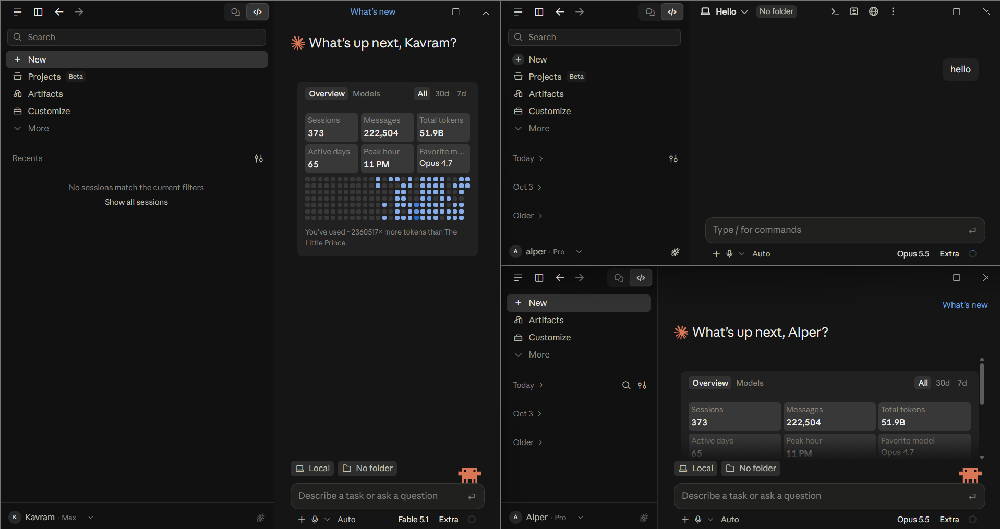
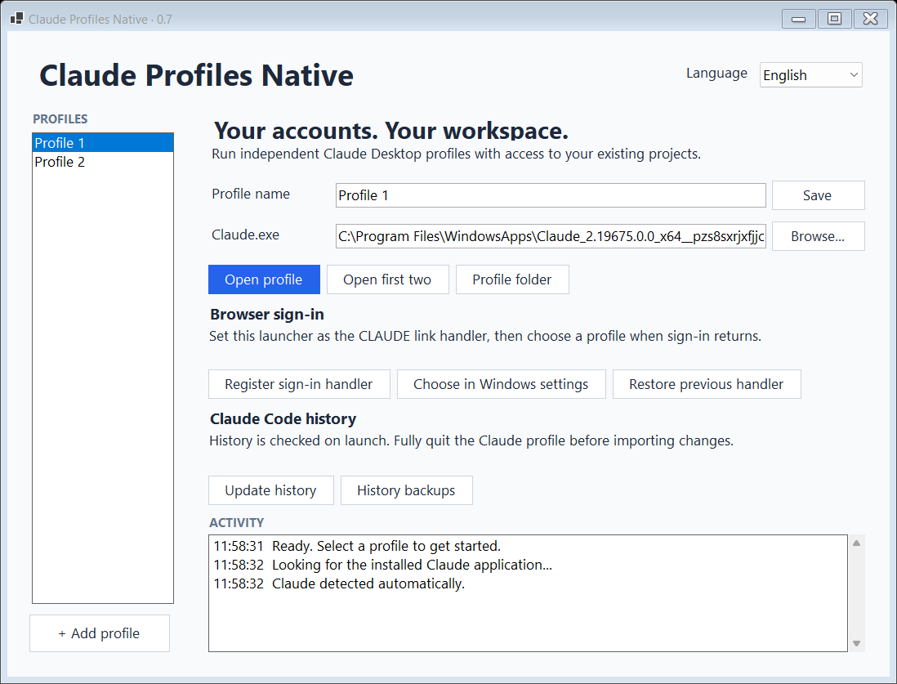
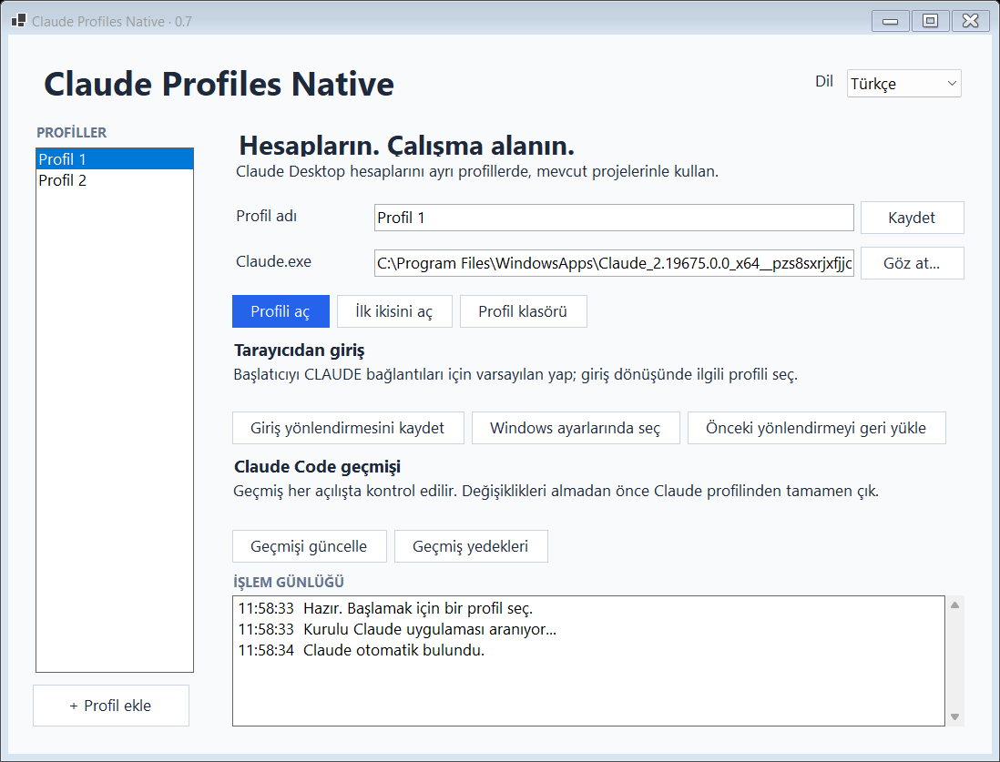

<div align="center">

# Claude Profiles Native

**Use multiple Claude accounts with ease.**

A Windows launcher for separate Claude Desktop profiles, with your projects right where they belong.


[](LICENSE)




*Separate accounts. Familiar workspaces. One launcher.*

</div>

<details open>
<summary><strong>English — setup, features &amp; documentation</strong></summary>

## What it does

Keep work and personal Claude accounts open at the same time. Each profile has its own Desktop sign-in and app data, while your projects, Claude Code transcripts and memory stay at their existing locations.

| Feature | What you get |
| --- | --- |
| Multiple accounts | Named, persistent profiles with independent Desktop sessions. |
| Browser sign-in | Google or email sign-in, with a profile chooser for browser returns. |
| Existing projects | Normal access to your files, subject to Windows permissions and Claude’s own tool permissions. |
| Code history | Import missing conversations and newer versions of existing records, with backups. |
| English & Turkish | Switch languages instantly; your preference is saved for the next launch. |
| Portable release | A single executable with its runtime included. |

## Get started

**Requirements:** Windows x64 and an installed Claude Desktop application.

1. Download the Windows x64 archive from this repository’s **Releases** section. Extract it into a stable folder and run `ClaudeProfilesNative.exe`.
2. The launcher tries to find the installed Microsoft Store `Claude.exe` automatically. If it cannot find it, use **Browse…** to select the executable.
3. Rename the default profiles or choose **+ Add profile**. Select a profile and click **Open profile**, or use **Open first two**.
4. Sign in to the desired Claude account in each window.

Use the **Language** menu at the top right to choose **English** or **Türkçe**. Changing the language preserves profile names, accounts and session directories.

### Automatic app discovery

When no application path has been selected, the launcher queries your registered x64 Claude package and falls back to scanning `Program Files/WindowsApps`. It matches versioned `Claude_<version>_x64__<publisher>/app/Claude.exe` paths and selects the newest valid package by numeric version. No administrator access or folder permission changes are needed.

Automatically discovered paths are refreshed on startup and before opening a profile, so Store updates can change the version folder. A path selected or entered manually is preserved. To return to automatic discovery, clear the application path and save, then open a profile or restart the launcher. Other installation types can be selected manually.

### Set up Google / browser sign-in

1. Click **Register sign-in handler**.
2. Click **Choose in Windows settings**.
3. In Windows Default Apps, set **Claude Profiles Native** as the default application for the **CLAUDE** link type.
4. Start sign-in from a Claude profile. When the browser returns, select the profile where you started signing in.

Google sign-in has been confirmed working in the tested installation. Keep the launcher in the same folder after registration. If you move it, register the sign-in handler again to update its location. Windows may require you to select the default application again.



## Bring your Claude Code history

The launcher checks existing Desktop history stores every time it opens a profile. It only imports records for account IDs already present in that profile.

For a new profile, sign in and start a Code conversation once so Claude creates the account’s history directory. Then fully **Quit** that Claude profile and reopen it from the launcher.

To import changes manually, quit the Claude profile first, select it in the launcher and click **Update history**. Reopen it to refresh the sidebar. Closing a window with **X** may leave Claude running in the system tray.

| Source record | Result |
| --- | --- |
| Missing in the profile | Imported. |
| Has a newer `lastActivityAt` | Replaces the profile’s record; its previous version is backed up. |
| Same or older activity | The profile’s existing record is preserved. |
| Invalid record or missing activity information | Existing records are not replaced. |

History is checked on launch or on demand; it is not a live, two-way sync. Deletions and changes with the same activity time are not mirrored. Only Code list records are imported; authentication data and Cowork snapshots are excluded.

### Using Claude Session Mover

[Claude Session Mover](https://github.com/alpersamur3/claude-session-mover) can move conversations between accounts. After a transfer, fully quit the target Claude profile and reopen it from this launcher. Missing or more advanced records in the original Desktop store will be picked up automatically, including updated transcript references.

For direct access to a native profile’s list store, Session Mover also supports `CSM_BASE`. Point it to that profile’s `desktop-session/claude-code-sessions` directory. Follow the mover’s close-app instructions before changing records.

## Where data lives

Under your Windows **Documents** folder:

```text
ClaudeProfilesNative/
├── profiles.json                   # Profile names, IDs, language and app path
├── accounts/
│   └── <profile-id>/desktop-session/
└── history-backups/
    └── <profile-id>/
```

**Profile folder** opens the selected profile’s app data. **History backups** opens its saved record backups. Your existing `.claude/projects` transcripts and memory remain in their normal locations.

Profiles separate Desktop cookies, local storage, settings and cache as well as sign-in. They do not create separate Windows users or restrict project access. The launcher uses the installed Claude application’s native `--user-data-dir` option. Claude updates can affect compatibility.

The launcher does not read account tokens or save browser sign-in links in its settings or activity log. Profile directories themselves contain private Claude app data and should not be published.

## Build & contribute

Develop on Windows with the **.NET 8 SDK**:

```powershell
./test.ps1
./build.ps1
```

The executable is written to `dist/ClaudeProfilesNative.exe`. End users do not need to install .NET.

Translations live in [`src/Locales/en.json`](src/Locales/en.json) and [`src/Locales/tr.json`](src/Locales/tr.json). Keep translation keys and formatting placeholders identical across languages. Tests cover settings compatibility, language persistence, profile isolation and history updates. See [validation notes](VALIDATION.md) and the [changelog](CHANGELOG.md).

## Undo browser routing

Choose **Restore previous handler**. If you selected this launcher as the default for CLAUDE links in Windows, select Claude again in Default Apps as well. Your profiles and conversations are preserved.

## License

[MIT](LICENSE). This is an independent project, not affiliated with Anthropic. Claude Desktop must be installed separately; its application binaries are not distributed here. Bundled .NET runtime notices are included in [`licenses/`](licenses/).

</details>

<details>
<summary><strong>Türkçe — kurulum, özellikler ve kullanım</strong></summary>

## Ne işe yarar?

**Birden fazla Claude hesabını kolayca kullan.** İş ve kişisel hesaplarını aynı anda açık tut. Her profilin Desktop oturumu ve uygulama verileri ayrıdır; projelerin, Claude Code transkriptlerin ve hafızan mevcut konumlarında kalır.

| Özellik | Açıklama |
| --- | --- |
| Birden fazla hesap | Kendi adı ve kalıcı Desktop oturumu olan profiller. |
| Tarayıcıdan giriş | Google veya e-posta ile giriş; tarayıcı dönüşünde profil seçimi. |
| Mevcut projeler | Windows yetkileri ve Claude’un araç izinleri kapsamında normal dosya erişimi. |
| Code geçmişi | Eksik sohbetleri ve ilerlemiş mevcut kayıtları yedekle aktarım. |
| İngilizce ve Türkçe | Anında dil değiştirme; sonraki açılışta hatırlanan tercih. |
| Taşınabilir dağıtım | Çalışma zamanı dahil tek yürütülebilir dosya. |

## Başlangıç

**Gereksinimler:** Windows x64 ve kurulu Claude Desktop uygulaması.

1. Deponun **Releases** bölümünden Windows x64 arşivini indir. Sabit bir klasöre çıkarıp `ClaudeProfilesNative.exe` dosyasını çalıştır.
2. Başlatıcı kurulu Microsoft Store `Claude.exe` dosyasını otomatik bulmayı dener. Bulamazsa **Göz at…** ile yürütülebilir dosyayı seç.
3. Varsayılan profilleri adlandır veya **+ Profil ekle** düğmesini kullan. Bir profil seçip **Profili aç** düğmesine bas; iki pencere için **İlk ikisini aç** seçeneğini kullan.
4. Her pencerede istediğin Claude hesabıyla giriş yap.

Sağ üstteki **Dil** menüsünden **English** veya **Türkçe** seçebilirsin. Dil değişimi profil adlarını, hesapları ve oturum klasörlerini korur.

### Uygulamayı otomatik bulma

Uygulama yolu seçilmemişse başlatıcı kayıtlı x64 Claude paketini sorgular; gerekirse `Program Files/WindowsApps` klasörünü tarar. Sürümlü `Claude_<sürüm>_x64__<yayımcı>/app/Claude.exe` yollarını eşleştirip sayısal sürüme göre en yeni geçerli paketi seçer. Yönetici yetkisi veya klasör izinlerini değiştirme gerekmez.

Otomatik bulunan yol, açılışta ve profil başlatılmadan önce yeniden kontrol edilir; Store güncellemelerindeki sürüm klasörü değişiklikleri böylece yakalanır. Elle seçilen veya yazılan yol korunur. Otomatik bulmaya dönmek için uygulama yolunu temizleyip kaydet; ardından bir profil aç veya başlatıcıyı yeniden başlat. Diğer kurulum türleri elle seçilebilir.

### Google / tarayıcı girişini ayarla

1. **Giriş yönlendirmesini kaydet** düğmesine bas.
2. **Windows ayarlarında seç** düğmesine bas.
3. Windows Varsayılan Uygulamalar bölümünde **CLAUDE** bağlantı türü için **Claude Profiles Native** uygulamasını varsayılan seç.
4. Claude profilinden giriş işlemini başlat. Tarayıcıdan dönüşte girişe başladığın profili seç.

Google ile giriş test edilen kurulumda çalışıyor. Yönlendirmeyi kaydettikten sonra başlatıcıyı aynı klasörde tut. Taşırsan yeni konumu kaydetmek için giriş yönlendirmesini yeniden kaydet. Windows varsayılan uygulamayı yeniden seçmeni isteyebilir.



## Claude Code geçmişini kullan

Başlatıcı her profil açılışında mevcut Desktop geçmiş depolarını kontrol eder. Yalnızca o profilde zaten bulunan hesap kimliklerine ait kayıtları alır.

Yeni bir profilde giriş yaptıktan sonra bir Code sohbeti başlat; Claude hesabın geçmiş klasörünü oluşturur. Ardından o Claude profilinden **Çıkış/Quit** ile tamamen çıkıp başlatıcıdan yeniden aç.

Değişiklikleri elle almak için önce Claude profilinden çık, başlatıcıda profili seç ve **Geçmişi güncelle** düğmesine bas. Kenar çubuğunu yenilemek için profili yeniden aç. **X** düğmesi uygulamayı sistem tepsisinde açık bırakabilir.

| Kaynak kayıt | Sonuç |
| --- | --- |
| Profilde bulunmuyor | Eklenir. |
| `lastActivityAt` değeri daha yeni | Profildeki kayıt güncellenir; önceki hali yedeklenir. |
| Etkinlik zamanı eşit veya eski | Profildeki mevcut kayıt korunur. |
| Geçersiz kayıt veya eksik etkinlik bilgisi | Mevcut kayıt değiştirilmez. |

Geçmiş açılışta veya düğmeye basıldığında kontrol edilir; canlı ve iki yönlü eşitleme yapılmaz. Silmeler ve aynı etkinlik zamanındaki değişiklikler aktarılmaz. Yalnızca Code liste kayıtları alınır; giriş verileri ve Cowork klasörleri aktarılmaz.

### Claude Session Mover ile kullanım

[Claude Session Mover](https://github.com/alpersamur3/claude-session-mover) sohbetleri hesaplar arasında taşıyabilir. Taşıma sonrasında hedef Claude profilinden tamamen çıkıp bu başlatıcıdan yeniden aç. Normal Desktop deposundaki eksik veya ilerlemiş kayıtlar, güncellenen transkript referanslarıyla birlikte otomatik alınır.

Native profilin liste deposunu doğrudan kullanmak için Session Mover’ın `CSM_BASE` seçeneğini o profilin `desktop-session/claude-code-sessions` klasörüne yönlendirebilirsin. Kayıt değiştirmeden önce taşıyıcının uygulamayı kapatma talimatlarını uygula.

## Veriler nerede?

Windows **Belgeler** klasöründe:

```text
ClaudeProfilesNative/
├── profiles.json                   # Profil adları, kimlikler, dil ve uygulama yolu
├── accounts/
│   └── <profil-kimliği>/desktop-session/
└── history-backups/
    └── <profil-kimliği>/
```

**Profil klasörü** seçili profilin uygulama verilerini, **Geçmiş yedekleri** ise kayıt yedeklerini açar. Mevcut `.claude/projects` transkriptlerin ve hafızan normal konumlarında kalır.

Profiller girişle birlikte Desktop çerezlerini, yerel depolamayı, ayarları ve önbelleği de ayırır. Ayrı Windows kullanıcıları oluşturmaz ve proje erişimini kısıtlamaz. Başlatıcı, kurulu Claude uygulamasının `--user-data-dir` seçeneğini kullanır. Claude güncellemeleri uyumluluğu etkileyebilir.

Başlatıcı hesap tokenlarını okumaz; tarayıcı giriş bağlantılarını ayarlara veya işlem günlüğüne kaydetmez. Profil klasörleri özel Claude uygulama verileri içerir ve public olarak paylaşılmamalıdır.

## Derleme ve katkı

Windows’ta **.NET 8 SDK** ile:

```powershell
./test.ps1
./build.ps1
```

Çıktı `dist/ClaudeProfilesNative.exe` konumuna yazılır. Son kullanıcının .NET kurması gerekmez.

Çeviriler [`src/Locales/en.json`](src/Locales/en.json) ve [`src/Locales/tr.json`](src/Locales/tr.json) dosyalarındadır. İki dilde anahtarları ve biçimlendirme yer tutucularını aynı tut. Testler ayar uyumluluğunu, dil tercihinin saklanmasını, profil ayrımını ve geçmiş güncellemelerini kapsar. Ayrıntılar için [doğrulama notlarına](VALIDATION.md) ve [değişiklik günlüğüne](CHANGELOG.md) bak.

## Tarayıcı yönlendirmesini geri al

**Önceki yönlendirmeyi geri yükle** düğmesini kullan. Windows’ta CLAUDE bağlantıları için başlatıcıyı varsayılan seçtiysen Varsayılan Uygulamalar bölümünden tekrar Claude seç. Profillerin ve sohbetlerin korunur.

## Lisans

[MIT](LICENSE). Anthropic ile bağlantısı olmayan bağımsız bir projedir. Claude Desktop ayrıca kurulmalıdır; Claude uygulama dosyaları bu projeyle dağıtılmaz. Dahil edilen .NET çalışma zamanı bildirimleri [`licenses/`](licenses/) klasöründedir.

</details>
